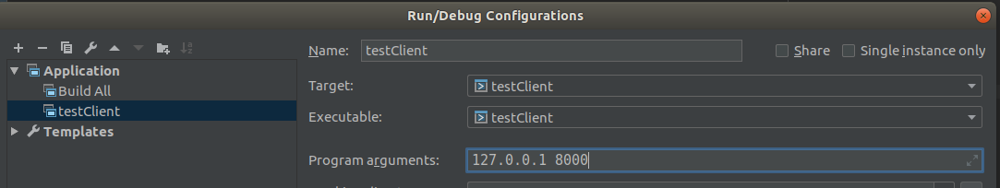

### How to build
```bash
gcc -pthread main.cpp -o main.out
```

### How to run

#### Bash
```bash
./main.out <server ip> <port>
```

eg.
```bash
./main.out 127.0.0.1 8000
```

It will connect you to 127.0.0.1:8000

#### Clion

You can just configure program arguments:


